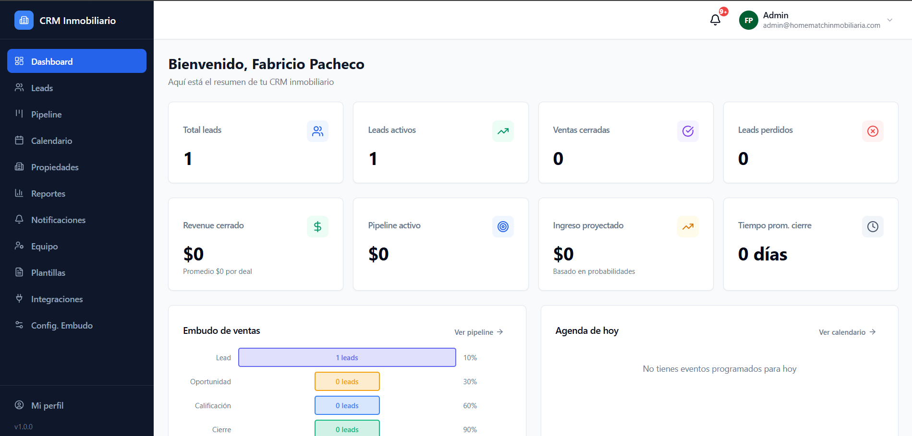
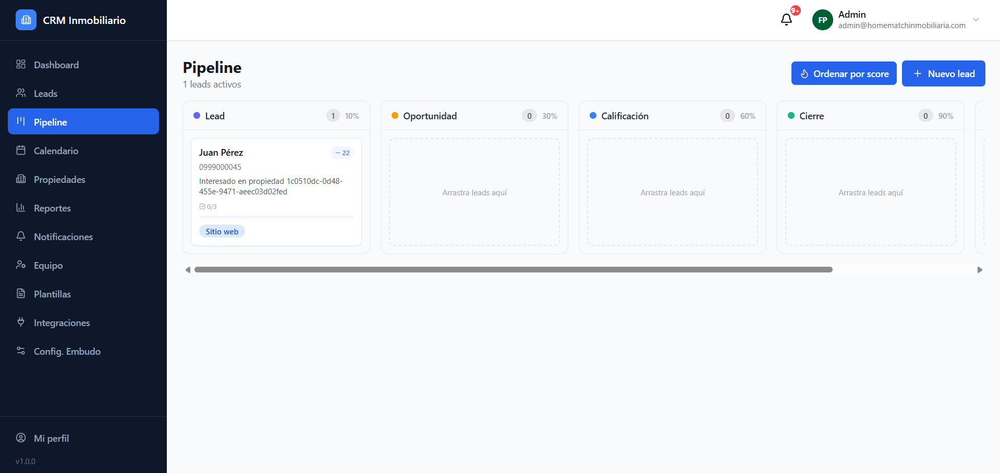
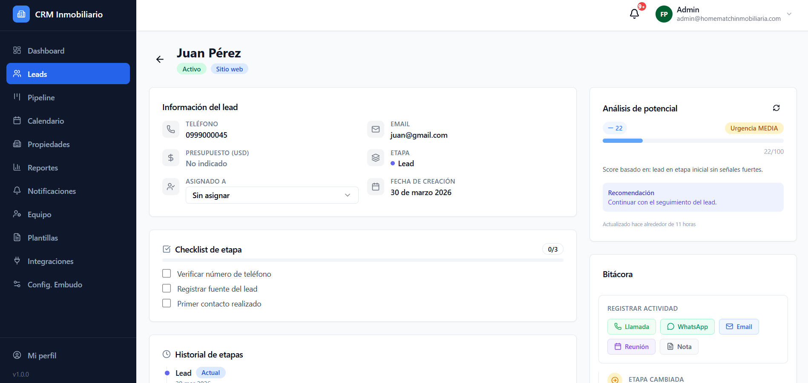
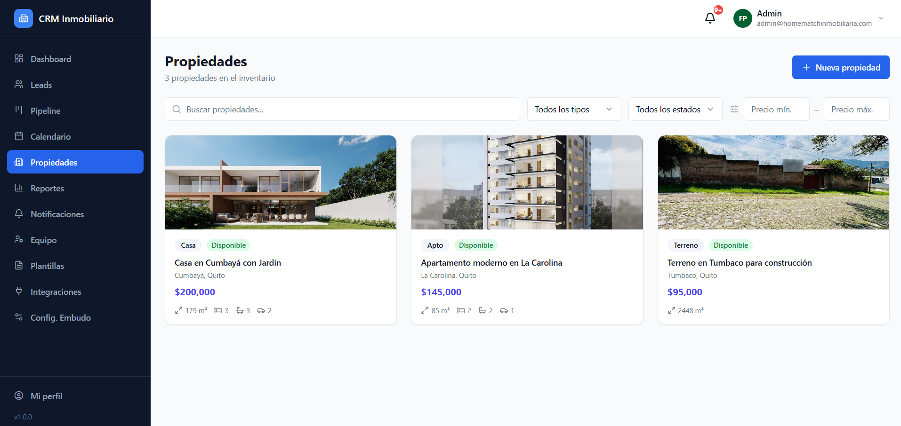
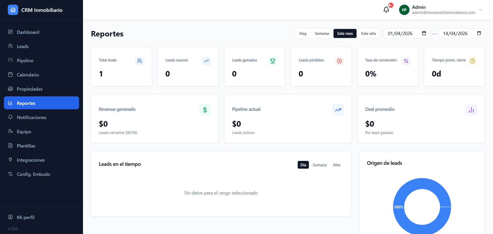
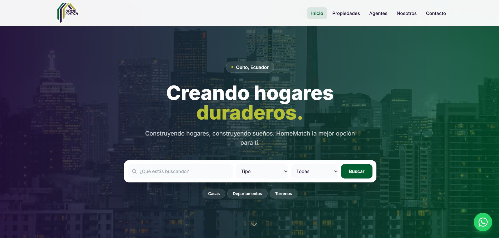

<div align="center">

# CRM Inmobiliario

### Sistema de gestión comercial para inmobiliarias

Plataforma completa que centraliza leads, pipeline de ventas, inventario de propiedades y comunicación con prospectos — en un solo lugar.

[](https://nestjs.com)
[](https://react.dev)
[](https://www.typescriptlang.org)
[](https://www.postgresql.org)
[](https://tailwindcss.com)
[](https://www.docker.com)

**[Ver demo en vivo](https://crm.homematchinmobiliaria.com)** · **[Sitio público](https://homematchinmobiliaria.com)**

</div>

---

## El problema que resuelve

Una inmobiliaria recibe decenas de consultas por semana: WhatsApp, portales, formularios web, Facebook Ads, referidos. Sin un sistema, esos contactos se pierden en chats, planillas y notas de voz. El equipo de ventas no sabe quién tiene qué prospecto, en qué estado está la negociación, ni cuándo fue el último contacto.

**Este CRM resuelve exactamente eso.** Centraliza todos los leads en un único sistema, ordena el proceso de ventas en etapas claras, y da al dueño de la inmobiliaria visibilidad total de lo que está pasando en su equipo — en tiempo real.

---

## Qué hace el sistema

### Captación y gestión de leads
Todos los prospectos en un solo lugar, sin importar por dónde llegaron. El sistema evita duplicados automáticamente y asigna leads a vendedores según disponibilidad.

### Pipeline de ventas visual
Un tablero estilo Kanban donde se arrastra cada lead a través de las etapas: **Lead → Oportunidad → Calificación → Cierre**. Cada etapa tiene su propio checklist de tareas, probabilidad de cierre y registro histórico de movimientos.

### Historial de comunicaciones
Cada interacción con el cliente queda registrada: llamadas, WhatsApp, correos, visitas. El vendedor que tome el caso siempre sabe el contexto completo, sin tener que preguntar.

### Inventario de propiedades
Catálogo interno de inmuebles con fotos, precio, ubicación en mapa y ficha técnica en PDF generada automáticamente con código QR. Cada propiedad puede vincularse a múltiples leads interesados.

### Comunicación integrada
Plantillas reutilizables para WhatsApp y email. El vendedor envía mensajes directamente desde el CRM, con el historial guardado en el lead.

### Scoring inteligente de leads
El sistema califica automáticamente cada lead con una puntuación del 1 al 100 basada en sus datos, nivel de interés y actividad reciente, para que el equipo priorice los más calificados.

### Reportes y KPIs
Panel de métricas en tiempo real: conversión por etapa, rendimiento por vendedor, fuentes de leads más efectivas, tiempo promedio de cierre y proyección de ingresos.

### Calendario de seguimiento
Agenda integrada de citas y recordatorios vinculados a cada lead. El sistema envía alertas automáticas cuando un prospecto lleva días sin contacto.

### Sitio web público conectado
Landing page de la inmobiliaria con catálogo de propiedades, buscador inteligente, mapas interactivos y formularios de contacto que ingresan leads directamente al CRM.

### Integraciones automáticas
Webhooks para Facebook Lead Ads y Google Ads: cuando alguien completa un formulario en redes sociales, el lead aparece en el CRM en segundos, sin intervención manual.

---

## Pantallas principales

> Las capturas a continuación muestran el sistema en producción.

| Dashboard | Pipeline Kanban |
|:---------:|:---------------:|
|  |  |

| Detalle de Lead | Propiedades |
|:---------------:|:-----------:|
|  |  |

| Reportes | Sitio Web Público |
|:--------:|:-----------------:|
|  |  |

---

## Arquitectura del sistema

```
┌─────────────────┐    ┌─────────────────┐    ┌─────────────────┐
│   CRM Frontend  │    │  Sitio Web      │    │  Integraciones  │
│  (Panel Admin)  │    │  Público        │    │  Facebook / Google│
│  React + Vite   │    │  React + Vite   │    │  Ads Webhooks   │
└────────┬────────┘    └────────┬────────┘    └────────┬────────┘
         │                      │                       │
         └──────────────────────┼───────────────────────┘
                                │  REST API
                     ┌──────────▼──────────┐
                     │     Backend API      │
                     │   NestJS + Prisma    │
                     │   BullMQ (colas)     │
                     └──────┬──────┬────────┘
                            │      │
               ┌────────────▼┐    ┌▼───────────┐
               │  PostgreSQL  │    │   Redis     │
               │  Base datos  │    │   Cache +   │
               │              │    │   Colas     │
               └─────────────┘    └─────────────┘
```

---

## Stack tecnológico

| Capa | Tecnología | Por qué |
|---|---|---|
| API | NestJS + TypeScript | Arquitectura modular, escalable y tipada |
| ORM | Prisma | Migraciones seguras, tipado de BD en TypeScript |
| Frontend | React 18 + Vite + Shadcn/ui | UI rápida, componentes accesibles |
| Estilos | Tailwind CSS | Diseño consistente y responsive |
| Estado | TanStack Query + Zustand | Cache inteligente del servidor, estado global simple |
| BD | PostgreSQL 15 | Relacional, robusto, ideal para multitenancy |
| Colas | BullMQ + Redis | Recordatorios, notificaciones y jobs asíncronos |
| Auth | JWT + Refresh Tokens | Sesiones seguras con renovación automática |
| Maps | Leaflet + OpenStreetMap | Mapas sin costo de licencia |
| Drag & Drop | DnD Kit | Kanban fluido con actualizaciones optimistas |
| PDF | Puppeteer | Fichas técnicas de propiedades con mapa y QR |
| IA | Google Gemini API | Scoring automático de leads |
| Infra | Docker Compose + PM2 | Deploy reproducible en VPS |

---

## Estado del proyecto

Este es un proyecto completo, deployado y en uso en producción.

| Módulo | Estado |
|---|---|
| Autenticación y roles (Admin / Vendedor) | ✅ Completo |
| Gestión de leads con deduplicación | ✅ Completo |
| Pipeline Kanban con drag & drop | ✅ Completo |
| Historial de interacciones (bitácora) | ✅ Completo |
| Inventario de propiedades con fotos | ✅ Completo |
| Ficha técnica PDF con mapa y QR | ✅ Completo |
| Comunicación WhatsApp y Email | ✅ Completo |
| Plantillas de mensajes | ✅ Completo |
| Calendario y recordatorios | ✅ Completo |
| Reportes y KPIs por vendedor | ✅ Completo |
| Lead scoring con IA (Gemini) | ✅ Completo |
| Notificaciones automáticas | ✅ Completo |
| Webhooks Facebook / Google Ads | ✅ Completo |
| Importación de leads desde Excel | ✅ Completo |
| Sitio web público con catálogo | ✅ Completo |
| Búsqueda inteligente de propiedades | ✅ Completo |
| Mapas interactivos | ✅ Completo |
| PWA instalable en móvil | ✅ Completo |
| Multitenancy (múltiples inmobiliarias) | ✅ Completo |
| Despliegue en VPS Hostinger | ✅ En producción |

---

## Correr el proyecto localmente

<details>
<summary>Ver instrucciones de instalación</summary>

**Requisitos:** Node.js 18+, Docker, npm 9+

```bash
# 1. Clonar e instalar
git clone <repo-url> && cd crm-inmobiliario
npm install

# 2. Variables de entorno
cp .env.example apps/backend/.env
cp apps/frontend/.env.example apps/frontend/.env
cp apps/web/.env.example apps/web/.env
# Editar cada .env con tus valores

# 3. Base de datos
npm run docker:up
npm run migrate
npm run db:seed

# 4. Desarrollo
npm run dev
```

| App | URL |
|---|---|
| CRM | http://localhost:5173 |
| API | http://localhost:3000 |
| Sitio web | http://localhost:4000 |

</details>

---

<div align="center">

Desarrollado para **Inmobiliaria Homematch** · Ecuador · 2024–2025

</div>
